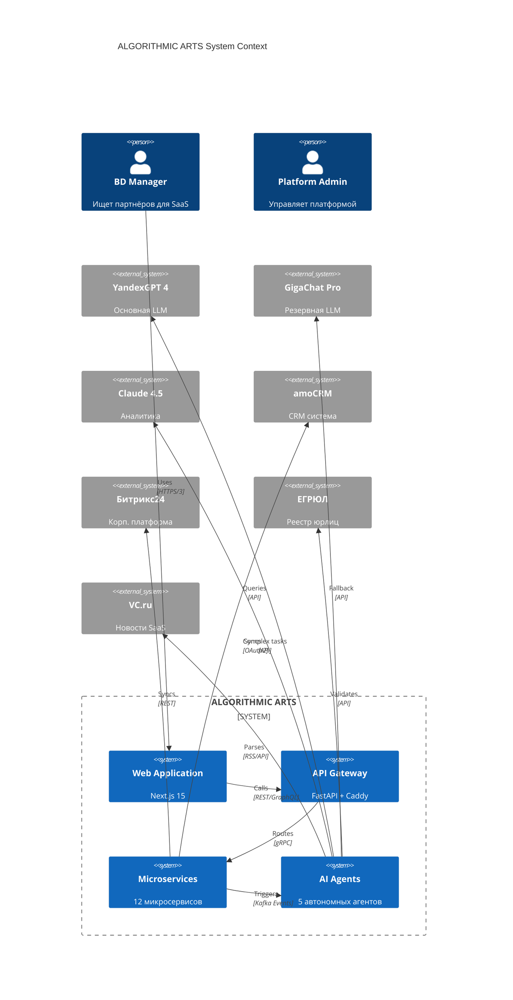

# Архитектура платформы ALGORITHMIC ARTS

**Версия:** 3.0  
**Дата:** Февраль 2026  
**Архитектурный стиль:** Event-Driven Microservices + CQRS + Saga Pattern

---

## Оглавление

1. [Высокоуровневая архитектура](#высокоуровневая-архитектура)
2. [Архитектурные принципы](#архитектурные-принципы)
3. [Микросервисная декомпозиция](#микросервисная-декомпозиция)
4. [Event-Driven Architecture](#event-driven-architecture)
5. [CQRS Pattern](#cqrs-pattern)
6. [AI Agents Architecture](#ai-agents-architecture)
7. [Data Architecture](#data-architecture)
8. [Security Architecture](#security-architecture)
9. [Масштабирование](#масштабирование)
10. [Disaster Recovery](#disaster-recovery)

---

## Высокоуровневая архитектура

### System Context Diagram (C4 Level 1)



### Container Diagram (C4 Level 2)

```
┌─────────────────────────────────────────────────────────────────┐
│                          EDGE LAYER                              │
│  ┌───────────────┐  ┌───────────────┐  ┌───────────────┐      │
│  │  Yandex CDN   │  │  Cloudflare   │  │  Yandex Shield│      │
│  │  (Static)     │  │  (DDoS)       │  │  (WAF)        │      │
│  └───────────────┘  └───────────────┘  └───────────────┘      │
└─────────────────────────────────────────────────────────────────┘
                              ↓ HTTP/3 (QUIC)
┌─────────────────────────────────────────────────────────────────┐
│                       FRONTEND LAYER                             │
│  ┌─────────────────────────────────────────────────────────┐   │
│  │  Next.js 15 Application (Edge Runtime)                  │   │
│  │  • React Server Components                              │   │
│  │  • Streaming SSR                                        │   │
│  │  • Partial Prerendering (PPR)                           │   │
│  │  • Turbopack (dev) / SWC (prod)                         │   │
│  └─────────────────────────────────────────────────────────┘   │
└─────────────────────────────────────────────────────────────────┘
                              ↓
┌─────────────────────────────────────────────────────────────────┐
│                      API GATEWAY LAYER                           │
│  ┌────────────────┐  ┌────────────────┐  ┌─────────────────┐  │
│  │  Caddy Server  │  │  Rate Limiter  │  │  Circuit        │  │
│  │  (Reverse      │  │  (Redis-based) │  │  Breaker        │  │
│  │   Proxy)       │  │                 │  │  (Resilience4j) │  │
│  └────────────────┘  └────────────────┘  └─────────────────┘  │
│  ┌─────────────────────────────────────────────────────────┐   │
│  │  FastAPI Application (API Gateway)                      │   │
│  │  • JWT Validation                                       │   │
│  │  • Request Routing (gRPC / REST)                        │   │
│  │  • API Versioning (/v1, /v2)                            │   │
│  │  • OpenAPI/Swagger Documentation                        │   │
│  └─────────────────────────────────────────────────────────┘   │
└─────────────────────────────────────────────────────────────────┘
                              ↓
┌─────────────────────────────────────────────────────────────────┐
│                    MICROSERVICES LAYER                           │
│                                                                  │
│  ┌──────────────┐  ┌──────────────┐  ┌──────────────┐         │
│  │ Auth Service │  │ User Service │  │Company Svc   │         │
│  │ (Port 8001)  │  │ (Port 8002)  │  │(Port 8003)   │         │
│  └──────────────┘  └──────────────┘  └──────────────┘         │
│                                                                  │
│  ┌──────────────┐  ┌──────────────┐  ┌──────────────┐         │
│  │Partner Svc   │  │AI Core + AI  │  │ Data Pipeline│         │
│  │(Port 8004)   │  │Agents (8005) │  │Service (8006)│         │
│  └──────────────┘  └──────────────┘  └──────────────┘         │
│                                                                  │
│  ┌──────────────┐  ┌──────────────┐  ┌──────────────┐         │
│  │  CRM Hub     │  │Search Service│  │Reporting Svc │         │
│  │Service (8007)│  │  (Port 8008) │  │(Port 8009)   │         │
│  └──────────────┘  └──────────────┘  └──────────────┘         │
│                                                                  │
│  ┌──────────────┐  ┌──────────────┐  ┌──────────────┐         │
│  │Billing Svc   │  │Notification  │  │Marketplace   │         │
│  │(Port 8010)   │  │Service (8011)│  │Service (8012)│         │
│  └──────────────┘  └──────────────┘  └──────────────┘         │
└─────────────────────────────────────────────────────────────────┘
                              ↓
┌─────────────────────────────────────────────────────────────────┐
│                        EVENT BUS LAYER                           │
│  ┌─────────────────────────────────────────────────────────┐   │
│  │  Apache Kafka 3.7 Cluster (3 brokers)                   │   │
│  │  Topics:                                                 │   │
│  │  • company.created • company.updated                     │   │
│  │  • partnership.matched • crm.sync.requested              │   │
│  │  • ai.analysis.completed • user.activity                 │   │
│  │                                                           │   │
│  │  Kafka Connect:                                          │   │
│  │  • PostgreSQL CDC (Debezium)                             │   │
│  │  • Elasticsearch Sink                                    │   │
│  │  • ClickHouse Sink                                       │   │
│  └─────────────────────────────────────────────────────────┘   │
└─────────────────────────────────────────────────────────────────┘
                              ↓
┌─────────────────────────────────────────────────────────────────┐
│                      DATA LAYER                                  │
│                                                                  │
│  ┌────────────────────────────────────────────────┐            │
│  │  PostgreSQL 17 Cluster (Primary + 2 Replicas)  │            │
│  │  • Extensions: pgvector, pg_cron, Citus        │            │
│  │  • Connection Pooling: PgBouncer               │            │
│  │  • Backup: WAL-G to Yandex Object Storage      │            │
│  └────────────────────────────────────────────────┘            │
│                                                                  │
│  ┌────────────────────────────────────────────────┐            │
│  │  Redis Stack 7.4 Cluster (3 nodes)             │            │
│  │  • Modules: RedisJSON, RedisSearch, RedisGraph │            │
│  │  • Use cases: Cache, Sessions, Vector Search   │            │
│  │  • Persistence: AOF + RDB                       │            │
│  └────────────────────────────────────────────────┘            │
│                                                                  │
│  ┌────────────────────────────────────────────────┐            │
│  │  Elasticsearch 8.14 Cluster (3 nodes)          │            │
│  │  • Full-text search + Vector search (dense)    │            │
│  │  • ILM: Hot(7d) → Warm(30d) → Cold(365d)      │            │
│  │  • Snapshot: Daily to Object Storage           │            │
│  └────────────────────────────────────────────────┘            │
│                                                                  │
│  ┌────────────────────────────────────────────────┐            │
│  │  ClickHouse 24.1 Cluster (2 shards x 2 replicas│            │
│  │  • Analytics + Time-series data                │            │
│  │  • Tables: user_events, search_queries, metrics│            │
│  │  • TTL: 90 days                                 │            │
│  └────────────────────────────────────────────────┘            │
│                                                                  │
│  ┌────────────────────────────────────────────────┐            │
│  │  MinIO (S3-compatible Object Storage)          │            │
│  │  • Buckets: uploads, backups, reports          │            │
│  │  • Versioning: Enabled                          │            │
│  │  • Encryption: AES-256-GCM                      │            │
│  └────────────────────────────────────────────────┘            │
└─────────────────────────────────────────────────────────────────┘
                              ↓
┌─────────────────────────────────────────────────────────────────┐
│                   OBSERVABILITY LAYER                            │
│  ┌────────────┐  ┌────────────┐  ┌────────────┐  ┌──────────┐ │
│  │Prometheus  │  │  Grafana   │  │   Loki     │  │  Jaeger  │ │
│  │(Metrics)   │  │ (Dashboards│  │   (Logs)   │  │(Tracing) │ │
│  └────────────┘  └────────────┘  └────────────┘  └──────────┘ │
└─────────────────────────────────────────────────────────────────┘
```

---

## Архитектурные принципы

### 1. Twelve-Factor App

Все микросервисы следуют принципам [12-Factor App](https://12factor.net/):

| Принцип | Реализация |
|---------|------------|
| **I. Codebase** | Один репозиторий на GitHub, множество деплойментов |
| **II. Dependencies** | Poetry (Python), npm (Node.js) — явное объявление |
| **III. Config** | Все через переменные окружения (.env) |
| **IV. Backing services** | PostgreSQL, Redis, Kafka как attached resources |
| **V. Build, release, run** | Docker multi-stage builds, GitOps |
| **VI. Processes** | Stateless сервисы, состояние в БД/Redis |
| **VII. Port binding** | Каждый сервис — отдельный порт |
| **VIII. Concurrency** | Horizontal scaling через Kubernetes HPA |
| **IX. Disposability** | Graceful shutdown за < 10 сек |
| **X. Dev/prod parity** | Docker Compose локально = K8s в production |
| **XI. Logs** | Stdout/stderr → Loki aggregation |
| **XII. Admin processes** | Одноразовые task через Celery |

### 2. Domain-Driven Design (DDD)

**Bounded Contexts:**

```
┌─────────────────────────────────────────────────────────────┐
│                   PARTNERSHIP DOMAIN                         │
│  ┌────────────────┐  ┌────────────────┐  ┌──────────────┐  │
│  │   Company      │  │   Partnership  │  │ Compatibility│  │
│  │   Context      │  │   Context      │  │   Context    │  │
│  └────────────────┘  └────────────────┘  └──────────────┘  │
└─────────────────────────────────────────────────────────────┘

┌─────────────────────────────────────────────────────────────┐
│                   IDENTITY DOMAIN                            │
│  ┌────────────────┐  ┌────────────────┐                     │
│  │   Auth         │  │   User         │                     │
│  │   Context      │  │   Context      │                     │
│  └────────────────┘  └────────────────┘                     │
└─────────────────────────────────────────────────────────────┘

┌─────────────────────────────────────────────────────────────┐
│                   INTEGRATION DOMAIN                         │
│  ┌────────────────┐  ┌────────────────┐  ┌──────────────┐  │
│  │   CRM          │  │   Data         │  │ Notification │  │
│  │   Context      │  │   Pipeline     │  │   Context    │  │
│  └────────────────┘  └────────────────┘  └──────────────┘  │
└─────────────────────────────────────────────────────────────┘

┌─────────────────────────────────────────────────────────────┐
│                   MONETIZATION DOMAIN                        │
│  ┌────────────────┐  ┌────────────────┐                     │
│  │   Billing      │  │   Marketplace  │                     │
│  │   Context      │  │   Context      │                     │
│  └────────────────┘  └────────────────┘                     │
└─────────────────────────────────────────────────────────────┘
```

### 3. SOLID Principles

**В коде каждого микросервиса:**

- **S** (Single Responsibility): Один сервис = одна бизнес-задача
- **O** (Open/Closed): Расширение через плагины, не модификация кода
- **L** (Liskov Substitution): Интерфейсы для всех внешних зависимостей
- **I** (Interface Segregation): Тонкие, специфичные интерфейсы
- **D** (Dependency Inversion): Зависимость от абстракций, не реализаций

### 4. Cloud-Native Patterns

| Паттерн | Применение |
|---------|------------|
| **Circuit Breaker** | Защита от каскадных сбоев (Resilience4j) |
| **Bulkhead** | Изоляция ресурсов между сервисами |
| **Retry with Exponential Backoff** | Автоматические повторы запросов |
| **Health Check** | Kubernetes liveness/readiness probes |
| **Service Mesh** | Istio для межсервисной коммуникации (планируется) |
| **Sidecar** | Logging, monitoring агенты |

---

## Микросервисная декомпозиция

### Сервисная матрица

| Сервис | Ответственность | Tech Stack | База данных | Async Jobs | gRPC |
|--------|-----------------|------------|-------------|------------|------|
| **auth-service** | Аутентификация, авторизация | FastAPI, JWT | PostgreSQL | - | ✅ |
| **user-service** | Управление профилями | FastAPI | PostgreSQL | Celery | ✅ |
| **company-service** | CRUD компаний | FastAPI | PostgreSQL + Citus | Celery | ✅ |
| **partner-service** | Рекомендации партнёрств | FastAPI | PostgreSQL | Celery | ✅ |
| **ai-core-service** | AI-анализ + Multi-agent | FastAPI, LangChain | PostgreSQL, Redis | Celery | ✅ |
| **data-pipeline** | Парсинг, ETL | FastAPI, Scrapy | PostgreSQL | Celery | ✅ |
| **crm-hub** | Унифицированная CRM интеграция | FastAPI | PostgreSQL | Celery | ✅ |
| **search-service** | Гибридный поиск | FastAPI | Elasticsearch | - | ✅ |
| **reporting-service** | Генерация отчётов | FastAPI, Jinja2 | PostgreSQL, ClickHouse | Celery | ✅ |
| **billing-service** | Подписки, платежи | FastAPI | PostgreSQL | Celery | ✅ |
| **notification-service** | Email/Telegram/Push | FastAPI | Redis Streams | Celery | - |
| **marketplace-service** | Биржа партнёрств | FastAPI | PostgreSQL | Celery | ✅ |

### Inter-Service Communication

**Синхронное взаимодействие (Request-Response):**

```python
# gRPC пример
# auth-service/protos/auth.proto
syntax = "proto3";

service AuthService {
  rpc ValidateToken(TokenRequest) returns (TokenResponse);
  rpc GetUserPermissions(UserRequest) returns (PermissionsResponse);
}

message TokenRequest {
  string token = 1;
}

message TokenResponse {
  bool valid = 1;
  string user_id = 2;
  repeated string roles = 3;
}
```

**Асинхронное взаимодействие (Event-Driven):**

```python
# company-service publishes event
from shared.events import publish_event

async def create_company(company_data: CompanyCreate):
    company = await crud.create_company(db, company_data)
    
    # Publish event to Kafka
    await publish_event(
        topic="company.created",
        key=str(company.id),
        value={
            "company_id": str(company.id),
            "name": company.name,
            "industry": company.industry,
            "timestamp": datetime.utcnow().isoformat()
        }
    )
    
    return company
```

---

## Event-Driven Architecture

### Event Types

**Command Events** (запрос на действие):
```json
{
  "event_type": "crm.sync.requested",
  "aggregate_id": "company-123",
  "timestamp": "2026-02-11T10:30:00Z",
  "payload": {
    "company_id": "company-123",
    "crm_type": "amocrm",
    "sync_direction": "bidirectional"
  }
}
```

**Domain Events** (что-то случилось):
```json
{
  "event_type": "company.created",
  "aggregate_id": "company-456",
  "timestamp": "2026-02-11T10:35:00Z",
  "payload": {
    "company_id": "company-456",
    "name": "New SaaS Startup",
    "industry": "fintech"
  }
}
```

**Integration Events** (для внешних систем):
```json
{
  "event_type": "partnership.matched",
  "aggregate_id": "match-789",
  "timestamp": "2026-02-11T10:40:00Z",
  "payload": {
    "match_id": "match-789",
    "company_a": "company-123",
    "company_b": "company-456",
    "compatibility_score": 0.87
  }
}
```

### Kafka Topics Structure

```
company.commands         # Commands для Company Aggregate
company.events           # Domain events от Company
company.snapshots        # Event Sourcing snapshots

partnership.commands
partnership.events
partnership.snapshots

user.commands
user.events

crm.integration.events   # События от CRM систем
notification.events      # Очередь уведомлений

ai.analysis.queue        # Очередь для AI-анализа
ai.analysis.results      # Результаты AI-анализа
```

### Event Sourcing Example

```python
# Event Store
class CompanyEventStore:
    async def append_event(self, aggregate_id: UUID, event: DomainEvent):
        """Добавить событие в event store"""
        await db.execute(
            """
            INSERT INTO company_events 
            (aggregate_id, event_type, payload, version, timestamp)
            VALUES ($1, $2, $3, $4, $5)
            """,
            aggregate_id, event.type, event.payload, 
            event.version, event.timestamp
        )
        
        # Publish to Kafka
        await kafka_producer.send(
            topic=f"company.events",
            key=str(aggregate_id),
            value=event.to_dict()
        )
    
    async def get_events(self, aggregate_id: UUID, from_version: int = 0):
        """Получить все события для aggregate"""
        rows = await db.fetch(
            """
            SELECT * FROM company_events
            WHERE aggregate_id = $1 AND version > $2
            ORDER BY version ASC
            """,
            aggregate_id, from_version
        )
        return [DomainEvent.from_row(row) for row in rows]
    
    async def rebuild_aggregate(self, aggregate_id: UUID) -> Company:
        """Восстановить состояние из событий"""
        events = await self.get_events(aggregate_id)
        company = Company()
        for event in events:
            company.apply_event(event)
        return company
```

---

## CQRS Pattern

### Command Side (Write)

```python
# company-service/commands/create_company.py
from dataclasses import dataclass
from uuid import UUID

@dataclass
class CreateCompanyCommand:
    name: str
    industry: str
    website: str
    user_id: UUID

class CreateCompanyHandler:
    def __init__(self, event_store: CompanyEventStore):
        self.event_store = event_store
    
    async def handle(self, command: CreateCompanyCommand) -> UUID:
        # Валидация
        if await self.company_exists(command.name):
            raise CompanyAlreadyExistsError()
        
        # Создание aggregate
        company_id = uuid4()
        event = CompanyCreatedEvent(
            aggregate_id=company_id,
            name=command.name,
            industry=command.industry,
            website=command.website,
            created_by=command.user_id
        )
        
        # Сохранение события
        await self.event_store.append_event(company_id, event)
        
        return company_id
```

### Query Side (Read)

```python
# company-service/queries/get_companies.py
from typing import List
from elasticsearch import AsyncElasticsearch

class GetCompaniesQuery:
    def __init__(self, es: AsyncElasticsearch):
        self.es = es
    
    async def execute(
        self,
        industry: Optional[str] = None,
        min_employees: Optional[int] = None,
        skip: int = 0,
        limit: int = 20
    ) -> List[CompanyReadModel]:
        
        # Строим Elasticsearch запрос
        query = {"bool": {"must": []}}
        
        if industry:
            query["bool"]["must"].append({
                "term": {"industry.keyword": industry}
            })
        
        if min_employees:
            query["bool"]["must"].append({
                "range": {"employees_count": {"gte": min_employees}}
            })
        
        # Выполняем поиск
        response = await self.es.search(
            index="companies",
            query=query,
            from_=skip,
            size=limit,
            sort=[{"created_at": "desc"}]
        )
        
        return [
            CompanyReadModel.from_es_hit(hit)
            for hit in response["hits"]["hits"]
        ]
```

### Read Model Projection

```python
# Kafka consumer для обновления read model
from aiokafka import AIOKafkaConsumer

async def company_projection_worker():
    consumer = AIOKafkaConsumer(
        'company.events',
        bootstrap_servers='kafka:9092',
        group_id='company-read-model-projection'
    )
    
    await consumer.start()
    
    try:
        async for msg in consumer:
            event = json.loads(msg.value)
            
            if event['event_type'] == 'company.created':
                await update_elasticsearch(event)
                await update_clickhouse_analytics(event)
            
            elif event['event_type'] == 'company.updated':
                await update_elasticsearch(event)
            
    finally:
        await consumer.stop()
```

---

## AI Agents Architecture

### Multi-Agent System

```python
# ai-agents/base_agent.py
from abc import ABC, abstractmethod
from langchain.agents import AgentExecutor
from langchain.memory import ConversationBufferMemory

class BaseAgent(ABC):
    def __init__(self, llm, tools: List[Tool]):
        self.llm = llm
        self.tools = tools
        self.memory = ConversationBufferMemory()
        self.agent = self._create_agent()
    
    @abstractmethod
    def _create_agent(self) -> AgentExecutor:
        """Создать агента с конкретной логикой"""
        pass
    
    @abstractmethod
    async def run(self, input_data: dict) -> dict:
        """Запустить агента"""
        pass


# ai-agents/scout_agent.py
class PartnershipScoutAgent(BaseAgent):
    """Агент для непрерывного мониторинга экосистемы"""
    
    def _create_agent(self) -> AgentExecutor:
        from langchain.agents import create_react_agent
        from langchain.prompts import PromptTemplate
        
        prompt = PromptTemplate(
            template="""
            Ты — агент Partnership Scout. Твоя задача: мониторить новости,
            обновления компаний и выявлять потенциальные партнёрства.
            
            Доступные инструменты:
            {tools}
            
            Входные данные:
            {input}
            
            {agent_scratchpad}
            """,
            input_variables=["tools", "input", "agent_scratchpad"]
        )
        
        return create_react_agent(
            llm=self.llm,
            tools=self.tools,
            prompt=prompt
        )
    
    async def run(self, input_data: dict) -> dict:
        # Получаем последние новости из VC.ru, Habr
        news = await self._fetch_latest_news()
        
        # Анализируем с помощью LLM
        analysis = await self.agent.ainvoke({
            "input": f"Проанализируй следующие новости и найди возможности для партнёрств: {news}"
        })
        
        # Сохраняем результаты
        await self._save_insights(analysis)
        
        return analysis


# ai-agents/compatibility_agent.py
class CompatibilityAnalyzerAgent(BaseAgent):
    """Агент для анализа совместимости продуктов"""
    
    def _create_agent(self) -> AgentExecutor:
        from langchain_community.vectorstores import FAISS
        from langchain.embeddings import OpenAIEmbeddings
        
        # Загружаем векторную базу с описаниями продуктов
        self.vectorstore = FAISS.load_local(
            "data/company_embeddings",
            OpenAIEmbeddings()
        )
        
        prompt = PromptTemplate(
            template="""
            Ты — эксперт по B2B SaaS партнёрствам. Оцени совместимость двух продуктов.
            
            Компания A: {company_a}
            Компания B: {company_b}
            
            Критерии:
            - Технологическая совместимость
            - Пересечение целевых аудиторий
            - Дополняемость функционала
            - Отсутствие прямой конкуренции
            
            Оцени от 0 до 1 и объясни.
            
            {agent_scratchpad}
            """,
            input_variables=["company_a", "company_b", "agent_scratchpad"]
        )
        
        return create_react_agent(self.llm, self.tools, prompt)
    
    async def run(self, input_data: dict) -> dict:
        company_a_id = input_data["company_a_id"]
        company_b_id = input_data["company_b_id"]
        
        # Получаем данные компаний
        company_a = await get_company(company_a_id)
        company_b = await get_company(company_b_id)
        
        # Анализируем совместимость
        result = await self.agent.ainvoke({
            "company_a": company_a.to_dict(),
            "company_b": company_b.to_dict()
        })
        
        # Парсим score из ответа
        score = self._extract_score(result["output"])
        
        return {
            "score": score,
            "explanation": result["output"],
            "timestamp": datetime.utcnow()
        }
```

### Agent Orchestration

```python
# ai-agents/orchestrator.py
from langgraph.graph import StateGraph, END

class AgentOrchestrator:
    """Оркестратор для управления мультиагентными workflow"""
    
    def __init__(self):
        self.scout = PartnershipScoutAgent(llm, tools)
        self.analyzer = CompatibilityAnalyzerAgent(llm, tools)
        self.writer = OutreachWriterAgent(llm, tools)
        self.graph = self._build_graph()
    
    def _build_graph(self) -> StateGraph:
        workflow = StateGraph(AgentState)
        
        # Добавляем ноды
        workflow.add_node("scout", self.scout.run)
        workflow.add_node("analyzer", self.analyzer.run)
        workflow.add_node("writer", self.writer.run)
        workflow.add_node("human_review", self.human_review_node)
        
        # Добавляем рёбра
        workflow.add_edge("scout", "analyzer")
        workflow.add_conditional_edges(
            "analyzer",
            self.should_write_outreach,
            {
                True: "writer",
                False: END
            }
        )
        workflow.add_edge("writer", "human_review")
        workflow.add_edge("human_review", END)
        
        workflow.set_entry_point("scout")
        
        return workflow.compile()
    
    async def run_workflow(self, trigger_event: dict):
        """Запустить workflow с начальными данными"""
        initial_state = {
            "event": trigger_event,
            "insights": [],
            "matches": [],
            "messages": []
        }
        
        final_state = await self.graph.ainvoke(initial_state)
        
        return final_state
```

---

## Data Architecture

### Database Schema (PostgreSQL)

**companies table:**
```sql
CREATE TABLE companies (
    id UUID PRIMARY KEY DEFAULT gen_random_uuid(),
    name VARCHAR(500) NOT NULL,
    slug VARCHAR(500) UNIQUE NOT NULL,
    description TEXT,
    website VARCHAR(500),
    logo_url VARCHAR(1000),
    
    -- Classification
    industry VARCHAR(100) NOT NULL,
    sub_industries VARCHAR(100)[] DEFAULT '{}',
    business_model VARCHAR(50) CHECK (business_model IN ('B2B', 'B2C', 'B2B2C')),
    
    -- Company details
    founded_year INTEGER,
    headquarters_country VARCHAR(2),
    headquarters_city VARCHAR(255),
    employees_count INTEGER,
    employees_range VARCHAR(50),
    
    -- Funding
    funding_total BIGINT DEFAULT 0,
    funding_stage VARCHAR(50),
    last_funding_date DATE,
    
    -- Legal (Russia)
    inn VARCHAR(12),
    ogrn VARCHAR(15),
    kpp VARCHAR(9),
    legal_name VARCHAR(500),
    legal_address TEXT,
    
    -- Tech stack
    tech_stack JSONB DEFAULT '{}',
    integrations VARCHAR(255)[] DEFAULT '{}',
    api_available BOOLEAN DEFAULT FALSE,
    api_documentation_url VARCHAR(1000),
    
    -- AI enrichment
    ai_summary TEXT,
    ai_tags VARCHAR(100)[] DEFAULT '{}',
    ai_sentiment_score NUMERIC(3,2) CHECK (ai_sentiment_score BETWEEN -1 AND 1),
    embedding VECTOR(1536),  -- pgvector для similarity search
    last_ai_enrichment TIMESTAMP,
    
    -- Metadata
    is_verified BOOLEAN DEFAULT FALSE,
    is_active BOOLEAN DEFAULT TRUE,
    view_count INTEGER DEFAULT 0,
    created_at TIMESTAMP DEFAULT NOW(),
    updated_at TIMESTAMP DEFAULT NOW(),
    deleted_at TIMESTAMP,
    
    -- Indexes
    CONSTRAINT valid_inn CHECK (inn ~ '^\d{10}$|^\d{12}$'),
    CONSTRAINT valid_ogrn CHECK (ogrn ~ '^\d{13}$|^\d{15}$')
);

-- Indexes for performance
CREATE INDEX idx_companies_industry ON companies(industry);
CREATE INDEX idx_companies_slug ON companies(slug);
CREATE INDEX idx_companies_inn ON companies(inn) WHERE inn IS NOT NULL;
CREATE INDEX idx_companies_embedding ON companies USING ivfflat (embedding vector_cosine_ops);
CREATE INDEX idx_companies_ai_tags ON companies USING GIN (ai_tags);
CREATE INDEX idx_companies_active ON companies(is_active) WHERE is_active = TRUE;
```

**partnerships table:**
```sql
CREATE TABLE partnerships (
    id UUID PRIMARY KEY DEFAULT gen_random_uuid(),
    company_a_id UUID NOT NULL REFERENCES companies(id),
    company_b_id UUID NOT NULL REFERENCES companies(id),
    
    -- Compatibility
    compatibility_score NUMERIC(3,2) NOT NULL CHECK (compatibility_score BETWEEN 0 AND 1),
    match_reasons TEXT[] DEFAULT '{}',
    synergy_areas VARCHAR(100)[] DEFAULT '{}',
    
    -- Analysis
    analysis_method VARCHAR(50) DEFAULT 'ai',
    analyzed_by_agent VARCHAR(100),
    analysis_timestamp TIMESTAMP DEFAULT NOW(),
    ai_explanation TEXT,
    
    -- Status
    status VARCHAR(50) DEFAULT 'suggested' CHECK (
        status IN ('suggested', 'contacted', 'in_discussion', 'active', 'rejected', 'paused')
    ),
    contacted_at TIMESTAMP,
    partnership_started_at TIMESTAMP,
    
    -- Outcomes
    deal_value BIGINT,
    revenue_generated BIGINT DEFAULT 0,
    
    -- Metadata
    created_at TIMESTAMP DEFAULT NOW(),
    updated_at TIMESTAMP DEFAULT NOW(),
    
    CONSTRAINT different_companies CHECK (company_a_id != company_b_id),
    CONSTRAINT unique_partnership UNIQUE (company_a_id, company_b_id)
);

CREATE INDEX idx_partnerships_score ON partnerships(compatibility_score DESC);
CREATE INDEX idx_partnerships_status ON partnerships(status);
CREATE INDEX idx_partnerships_company_a ON partnerships(company_a_id);
CREATE INDEX idx_partnerships_company_b ON partnerships(company_b_id);
```

### Sharding Strategy (Citus)

```sql
-- Распределение таблицы companies по 4 шардам
SELECT create_distributed_table('companies', 'id');

-- Колокация таблиц для эффективных JOIN
SELECT create_distributed_table('partnerships', 'company_a_id', colocate_with => 'companies');
SELECT create_distributed_table('company_updates', 'company_id', colocate_with => 'companies');
```

### Caching Strategy

**Redis cache layers:**

```python
# L1: Hot data (TTL: 5 минут)
await redis.setex(
    f"company:{company_id}",
    300,
    json.dumps(company.dict())
)

# L2: Warm data (TTL: 1 час)
await redis.setex(
    f"companies:industry:{industry}",
    3600,
    json.dumps([c.dict() for c in companies])
)

# L3: Cold data (TTL: 24 часа)
await redis.setex(
    f"stats:daily:{date}",
    86400,
    json.dumps(stats)
)
```

**Cache invalidation:**
```python
# При обновлении компании — инвалидируем все связанные кэши
async def invalidate_company_cache(company_id: UUID):
    company = await get_company(company_id)
    
    pipeline = redis.pipeline()
    pipeline.delete(f"company:{company_id}")
    pipeline.delete(f"companies:industry:{company.industry}")
    pipeline.delete(f"search:cache:*")  # Wildcard deletion
    await pipeline.execute()
```

---

## Security Architecture

### Zero Trust Architecture

```
┌─────────────────────────────────────────────────────────────┐
│                   EXTERNAL PERIMETER                         │
│  • Cloudflare (DDoS Protection)                             │
│  • Yandex Shield (WAF)                                      │
│  • Yandex CDN (Static assets)                               │
└─────────────────────────────────────────────────────────────┘
                         ↓ TLS 1.3
┌─────────────────────────────────────────────────────────────┐
│                   EDGE LAYER                                 │
│  • mTLS between services                                    │
│  • JWT validation on every request                          │
│  • API rate limiting (100 req/min per user)                 │
└─────────────────────────────────────────────────────────────┘
                         ↓
┌─────────────────────────────────────────────────────────────┐
│                   SERVICE MESH (Future: Istio)               │
│  • Service-to-service authentication                        │
│  • Automatic mTLS                                            │
│  • Traffic encryption                                        │
│  • Authorization policies                                    │
└─────────────────────────────────────────────────────────────┘
                         ↓
┌─────────────────────────────────────────────────────────────┐
│                   APPLICATION LAYER                          │
│  • RBAC (Role-Based Access Control)                         │
│  • ABAC (Attribute-Based Access Control)                    │
│  • Input validation (Pydantic)                              │
│  • Output sanitization                                       │
└─────────────────────────────────────────────────────────────┘
                         ↓
┌─────────────────────────────────────────────────────────────┐
│                   DATA LAYER                                 │
│  • Encryption at rest (AES-256-GCM)                         │
│  • Column-level encryption (sensitive fields)               │
│  • Database firewall rules                                  │
│  • Audit logging (all writes)                               │
└─────────────────────────────────────────────────────────────┘
```

### Authentication Flow

```python
# JWT token structure
{
  "header": {
    "alg": "RS256",  # RSA signature
    "typ": "JWT",
    "kid": "key-2026-02"  # Key rotation
  },
  "payload": {
    "sub": "user-uuid-here",
    "email": "user@example.com",
    "roles": ["user", "company_admin"],
    "permissions": ["company:read", "company:write"],
    "company_id": "company-uuid",
    "iat": 1707649200,
    "exp": 1707652800,  # 1 hour
    "jti": "token-unique-id"  # Prevent replay attacks
  },
  "signature": "..."
}
```

### Authorization (RBAC + ABAC)

```python
# Политика авторизации
class Permission:
    COMPANY_READ = "company:read"
    COMPANY_WRITE = "company:write"
    PARTNERSHIP_READ = "partnership:read"
    PARTNERSHIP_WRITE = "partnership:write"
    USER_MANAGE = "user:manage"
    ADMIN_FULL = "admin:*"

class Role:
    FREE_USER = "free_user"
    PAID_USER = "paid_user"
    COMPANY_ADMIN = "company_admin"
    PLATFORM_ADMIN = "platform_admin"

# Role-Permission mapping
ROLE_PERMISSIONS = {
    Role.FREE_USER: [
        Permission.COMPANY_READ,
        Permission.PARTNERSHIP_READ,
    ],
    Role.PAID_USER: [
        Permission.COMPANY_READ,
        Permission.COMPANY_WRITE,
        Permission.PARTNERSHIP_READ,
        Permission.PARTNERSHIP_WRITE,
    ],
    Role.COMPANY_ADMIN: [
        Permission.COMPANY_READ,
        Permission.COMPANY_WRITE,
        Permission.PARTNERSHIP_READ,
        Permission.PARTNERSHIP_WRITE,
        Permission.USER_MANAGE,
    ],
    Role.PLATFORM_ADMIN: [
        Permission.ADMIN_FULL,
    ],
}

# Проверка прав в эндпоинте
@router.put("/companies/{company_id}")
async def update_company(
    company_id: UUID,
    data: CompanyUpdate,
    current_user: User = Depends(get_current_user),
    db: AsyncSession = Depends(get_db)
):
    # RBAC check
    if Permission.COMPANY_WRITE not in current_user.permissions:
        raise HTTPException(403, "Insufficient permissions")
    
    # ABAC check (attribute-based)
    company = await crud.get_company(db, company_id)
    if company.owner_id != current_user.id and not current_user.is_admin:
        raise HTTPException(403, "You can only edit your own companies")
    
    # Proceed with update...
```

---

## Масштабирование

### Horizontal Pod Autoscaler (HPA)

```yaml
apiVersion: autoscaling/v2
kind: HorizontalPodAutoscaler
metadata:
  name: company-service-hpa
spec:
  scaleTargetRef:
    apiVersion: apps/v1
    kind: Deployment
    name: company-service
  minReplicas: 3
  maxReplicas: 20
  metrics:
  - type: Resource
    resource:
      name: cpu
      target:
        type: Utilization
        averageUtilization: 70
  - type: Resource
    resource:
      name: memory
      target:
        type: Utilization
        averageUtilization: 80
  - type: Pods
    pods:
      metric:
        name: http_requests_per_second
      target:
        type: AverageValue
        averageValue: "1000"
  behavior:
    scaleDown:
      stabilizationWindowSeconds: 300
      policies:
      - type: Percent
        value: 50
        periodSeconds: 60
    scaleUp:
      stabilizationWindowSeconds: 0
      policies:
      - type: Percent
        value: 100
        periodSeconds: 30
      - type: Pods
        value: 4
        periodSeconds: 30
      selectPolicy: Max
```

### Database Scaling

**PostgreSQL Read Replicas:**

```yaml
# 1 Primary + 2 Read Replicas
apiVersion: postgresql.cnpg.io/v1
kind: Cluster
metadata:
  name: postgresql-cluster
spec:
  instances: 3
  primaryUpdateStrategy: unsupervised
  
  postgresql:
    parameters:
      max_connections: "500"
      shared_buffers: "2GB"
      effective_cache_size: "6GB"
      work_mem: "16MB"
  
  storage:
    size: 500Gi
    storageClass: yc-network-ssd
  
  backup:
    barmanObjectStore:
      destinationPath: s3://backups-bucket/postgresql
      s3Credentials:
        accessKeyId:
          name: s3-credentials
          key: ACCESS_KEY_ID
        secretAccessKey:
          name: s3-credentials
          key: SECRET_ACCESS_KEY
    retentionPolicy: "30d"
```

**Connection Pooling (PgBouncer):**

```ini
[databases]
algorithmic_arts = host=postgresql-cluster-rw port=5432 dbname=algorithmic_arts

[pgbouncer]
listen_port = 6432
listen_addr = *
auth_type = scram-sha-256
auth_file = /etc/pgbouncer/userlist.txt

# Connection pooling
pool_mode = transaction
max_client_conn = 10000
default_pool_size = 25
reserve_pool_size = 5
reserve_pool_timeout = 3

# Performance
server_idle_timeout = 600
server_lifetime = 3600
server_connect_timeout = 15
```

### Caching at Scale

**Multi-Layer Caching:**

```
┌─────────────────────────────────────────────────────────────┐
│                   L0: Client-side cache                      │
│  • Browser cache (static assets)                            │
│  • Service Worker (PWA)                                     │
│  • TTL: 7 days                                              │
└─────────────────────────────────────────────────────────────┘
                         ↓
┌─────────────────────────────────────────────────────────────┐
│                   L1: CDN cache                              │
│  • Yandex CDN                                               │
│  • Edge locations across Russia                            │
│  • TTL: 24 hours                                            │
└─────────────────────────────────────────────────────────────┘
                         ↓
┌─────────────────────────────────────────────────────────────┐
│                   L2: Application cache (Redis)              │
│  • Hot data (active companies, popular searches)           │
│  • TTL: 5-60 minutes                                        │
│  • Invalidation: on write                                   │
└─────────────────────────────────────────────────────────────┘
                         ↓
┌─────────────────────────────────────────────────────────────┐
│                   L3: Database query cache                   │
│  • PostgreSQL shared_buffers                                │
│  • Materialized views                                       │
│  • Refresh: every 15 minutes                                │
└─────────────────────────────────────────────────────────────┘
                         ↓
┌─────────────────────────────────────────────────────────────┐
│                   L4: Persistent storage                     │
│  • PostgreSQL on SSD                                        │
│  • No cache                                                 │
└─────────────────────────────────────────────────────────────┘
```

---

## Disaster Recovery

### RPO and RTO Targets

| Severity | RPO (Data Loss) | RTO (Downtime) | Strategy |
|----------|-----------------|----------------|----------|
| **Critical** | 0 minutes | 15 minutes | Active-active replication |
| **High** | 1 hour | 4 hours | Warm standby + automated failover |
| **Medium** | 24 hours | 8 hours | Daily backups + manual recovery |
| **Low** | 7 days | 24 hours | Weekly backups |

### Backup Strategy

```yaml
# PostgreSQL WAL-G continuous backup
apiVersion: batch/v1
kind: CronJob
metadata:
  name: postgresql-backup
spec:
  schedule: "0 */6 * * *"  # Every 6 hours
  jobTemplate:
    spec:
      template:
        spec:
          containers:
          - name: wal-g
            image: wal-g/wal-g:latest
            env:
            - name: PGHOST
              value: postgresql-cluster-rw
            - name: WALG_S3_PREFIX
              value: s3://backups/postgresql
            - name: AWS_ACCESS_KEY_ID
              valueFrom:
                secretKeyRef:
                  name: s3-credentials
                  key: access-key
            - name: AWS_SECRET_ACCESS_KEY
              valueFrom:
                secretKeyRef:
                  name: s3-credentials
                  key: secret-key
            command:
            - /bin/sh
            - -c
            - |
              wal-g backup-push /var/lib/postgresql/data
```

### Disaster Recovery Runbook

**Сценарий 1: Полный отказ датацентра**

1. **Detection** (автоматически):
   - Health checks падают > 3 минуты
   - Алерт в Slack/Telegram/PagerDuty

2. **Failover to secondary region** (15 минут):
   ```bash
   # Переключение DNS на резервный регион
   kubectl apply -f infra/kubernetes/failover/secondary-ingress.yaml
   
   # Поднимаем PostgreSQL из последнего бэкапа
   wal-g backup-fetch LATEST /var/lib/postgresql/data
   ```

3. **Validation** (5 минут):
   ```bash
   # Проверка сервисов
   kubectl get pods -n production
   
   # Smoke tests
   pytest tests/smoke/
   ```

4. **Communication**:
   - Status page обновление
   - Email всем пользователям
   - Постморtem через 24 часа

---

## Performance Metrics

### SLIs (Service Level Indicators)

| Метрика | Target | Measurement |
|---------|--------|-------------|
| **API Response Time (p95)** | < 500ms | Prometheus histogram |
| **API Response Time (p99)** | < 1s | Prometheus histogram |
| **Database Query Time (p95)** | < 200ms | pg_stat_statements |
| **AI Analysis Time (avg)** | < 30s | Custom metric |
| **Search Latency (p95)** | < 300ms | Elasticsearch monitoring |

### SLOs (Service Level Objectives)

| Service | Availability | Error Rate | Latency (p95) |
|---------|--------------|------------|---------------|
| **API Gateway** | 99.9% | < 0.1% | < 500ms |
| **Auth Service** | 99.95% | < 0.05% | < 200ms |
| **Company Service** | 99.9% | < 0.1% | < 500ms |
| **AI Core** | 99.5% | < 0.5% | < 30s |
| **Search** | 99.9% | < 0.1% | < 300ms |

### Error Budget

```python
# Пример расчёта error budget
SLO_TARGET = 0.999  # 99.9% availability
DAYS_IN_MONTH = 30

downtime_allowed = (1 - SLO_TARGET) * DAYS_IN_MONTH * 24 * 60
# = 0.001 * 30 * 24 * 60 = 43.2 minutes per month

# Если уже было 20 минут downtime:
remaining_budget = 43.2 - 20  # = 23.2 minutes
```

---

## Следующие шаги

- **[API Documentation](API_DOCUMENTATION.md)** — полная документация API
- **[Deployment Guide](DEPLOYMENT.md)** — развёртывание в production
- **[Getting Started](GETTING_STARTED.md)** — инструкция для разработчиков
- **[Compliance](COMPLIANCE_152FZ.md)** — соответствие 152-ФЗ

---

**Версия:** 3.0  
**Последнее обновление:** Февраль 2026  
**Статус:** Production  
**Архитектор:** Engineering Team
